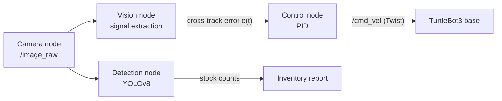

# 🤖 Autonomous Robot for Inventory Monitoring within SMEs

A low-cost autonomous mobile robot for **real-time inventory monitoring** in small and medium-sized enterprises (SMEs). The system fuses a custom-trained **YOLOv8** object detector with a **classical computer-vision signal-extraction pipeline** and a **Ziegler–Nichols-tuned PID controller**, all orchestrated as modular **ROS nodes** on a TurtleBot3-style platform.

The line-following controller achieves **< 5% overshoot** and a **settling time under 1 s**, and the detection stack reports stock levels with **no RFID or barcode hardware** required.

📹 **Full walkthrough & live demo:** https://www.youtube.com/watch?v=drLWpMeTv8o

---

## Pipeline at a glance



The robot follows a coloured floor line, continuously regressing a single steering signal from the camera stream; at predefined waypoints it stops and runs object detection to log inventory.

---

## 1. Vision as a Signal-Extraction Pipeline

Each camera frame is a discrete 2-D, 3-channel signal

$$
I_0:\Omega\to\mathbb{Z}^3,\qquad \Omega=\{0,\dots,W-1\}\times\{0,\dots,H-1\},\qquad I_0(x,y)=[B,G,R]^\top .
$$

We model it as a clean line component $S$ corrupted by additive and impulsive noise (motion blur, uneven lighting, specular highlights, sensor grain):

$$
I_0(x,y)=S(x,y)+N(x,y).
$$

The goal is to **demodulate** this high-dimensional, noisy field into one robust scalar — the steering error $e$ — through a composition of operators in which each stage's output is the conditioned input to the next:

$$
e=\bigl(\mathcal{T}_M\circ\mathcal{T}_W\circ\mathcal{T}_O\circ\mathcal{T}_\Theta\circ\mathcal{T}_G\circ\mathcal{T}_{\mathrm{HSV}}\bigr)(I_0).
$$

### Stage 1 — HSV colour-space transform

With normalised channels $R',G',B'\in[0,1]$ and $C_{\max}=\max(R',G',B')$, $C_{\min}=\min(R',G',B')$, $\Delta=C_{\max}-C_{\min}$:

$$
V=C_{\max},\qquad
S=\begin{cases}\Delta/C_{\max}, & C_{\max}\neq 0\\ 0,& \text{otherwise}\end{cases},\qquad
H=60^\circ\times
\begin{cases}
0, & \Delta=0\\
\frac{G'-B'}{\Delta}\bmod 6, & C_{\max}=R'\\
\frac{B'-R'}{\Delta}+2, & C_{\max}=G'\\
\frac{R'-G'}{\Delta}+4, & C_{\max}=B'.
\end{cases}
$$

**Why it feeds forward:** projecting BGR onto HSV decorrelates *chroma* $(H,S)$ from *luminance* $(V)$. The line then occupies a compact, illumination-invariant region of feature space, so the downstream threshold can be a fixed band that survives shadows and glare.

### Stage 2 — Gaussian low-pass filter

$$
I_2 = I_1 * G_\sigma,\qquad G_\sigma(x,y)=\frac{1}{2\pi\sigma^2}\,\exp\!\left(-\frac{x^2+y^2}{2\sigma^2}\right).
$$

**Why it feeds forward:** convolution with $G_\sigma$ attenuates the high-frequency band where noise $N$ concentrates, raising SNR *before* the nonlinear threshold. Smoothing first prevents isolated noise spikes from being quantised into the binary mask, where a linear filter could no longer remove them.

### Stage 3 — Threshold / colour masking

$$
B(x,y)=\prod_{c\in\{H,S,V\}}\mathbf{1}\!\left[\theta_c^{-}\le I_2^{c}(x,y)\le\theta_c^{+}\right]\in\{0,1\}.
$$

This is the `cv2.inRange` mask using the HSV bounds $\theta_c^{\pm}$ from the design document — a matched segmenter that keeps only pixels inside the line's colour band.

**Why it feeds forward:** because Stages 1–2 made the band compact and noise-suppressed, the indicator collapses three channels to a clean 1-bit-per-pixel field — the exact representation the morphological and moment operators expect.

### Stage 4 — Morphological opening

With structuring element $K$, opening is an erosion followed by a dilation:

$$
(B\ominus K)(x,y)=\min_{(i,j)\in K}B(x-i,\,y-j),\qquad
(B\oplus K)(x,y)=\max_{(i,j)\in K}B(x-i,\,y-j),
$$

$$
B_4=(B\ominus K)\oplus K.
$$

**Why it feeds forward:** opening is a rank filter that removes any connected component smaller than $K$ — the residual speckle that survived thresholding — while restoring line width and closing pinholes, guaranteeing the next stage integrates over a single coherent blob.

### Stage 5 — Region-of-interest gating

$$
B_5(x,y)=B_4(x,y)\,w(x,y),\qquad w(x,y)=\mathbf{1}\!\left[y\ge y_0\right].
$$

**Why it feeds forward:** windowing to the look-ahead band directly in front of the robot rejects far-field and off-path energy, minimising phase lag so the error reflects where the robot is *about to be* — directly improving settling time and stability.

### Stage 6 — Image-moment estimation

$$
M_{pq}=\sum_{x}\sum_{y}x^{p}y^{q}\,B_5(x,y),\qquad
c_x=\frac{M_{10}}{M_{00}},\qquad c_y=\frac{M_{01}}{M_{00}}.
$$

**Why it feeds forward:** the centroid is a maximum-likelihood location estimate under zero-mean pixel noise. If each inlier pixel has noise variance $\sigma_n^2$, the centroid variance scales as

$$
\operatorname{Var}(c_x)\approx\frac{\sigma_n^2}{M_{00}},
$$

so integrating over the $M_{00}$ line pixels suppresses residual noise by a factor of $\sqrt{M_{00}}$, collapsing the 2-D field to one high-SNR scalar.

### Output — the control error

$$
e(t)=c_x-\frac{W}{2}.
$$

The **cross-track error** is the centroid's deviation from the optical centre — the single feature handed to the controller.

### Why the cascade performs well

Each operator is chosen so its output lands in the ideal input domain of the next, producing two monotonic trends:

- **SNR increases** — HSV isolates the band, Gaussian filtering removes additive noise, opening removes impulsive noise, and moment integration averages out the remainder. Noise is attacked by linear, nonlinear, and statistical means in turn, so it never accumulates.
- **Dimensionality decreases** — $\mathbb{Z}^3 \to \{0,1\} \to \mathbb{R}$. Information irrelevant to steering is discarded early and cheaply, keeping per-frame latency low.

Ordering is deliberate: smoothing *before* thresholding stops noise being frozen into the mask; opening *before* moments guarantees a single region to integrate; gating *before* the centroid removes lag-inducing far-field data. The result is a clean, low-latency, high-SNR error signal — a well-conditioned input for the PID controller.

---

## 2. Control — Ziegler–Nichols-Tuned PID

The error $e(t)$ drives a PID controller that commands angular velocity, steering the centroid back to the image centre:

$$
u(t)=K_p\,e(t)+K_i\!\int_0^{t}\!e(\tau)\,d\tau+K_d\,\frac{d e(t)}{dt}.
$$

Discretised at the camera frame period $\Delta t$:

$$
u_k=K_p\,e_k+K_i\sum_{j=0}^{k}e_j\,\Delta t+K_d\,\frac{e_k-e_{k-1}}{\Delta t}.
$$

$u_k$ is published as the angular term `angular.z` of a ROS `Twist`, while a constant forward velocity `linear.x` is held.

**Tuning (ultimate-gain method).** With $K_i=K_d=0$, raise the proportional gain until the loop sustains stable oscillation at ultimate gain $K_u$ and period $T_u$; the classic PID gains then follow:

| Gain | Formula |
|------|---------|
| $K_p$ | $0.6\,K_u$ |
| $K_i$ | $1.2\,K_u/T_u$ |
| $K_d$ | $0.075\,K_u T_u$ |

equivalently $T_i=0.5\,T_u$ and $T_d=0.125\,T_u$. Step and trajectory responses were modelled in **Matplotlib** to confirm **< 5% overshoot** and **< 1 s settling time** before deployment.

---

## 3. Inventory Detection — Custom YOLOv8

At waypoints (triggered by a change in line colour) the robot stops and runs a **custom YOLOv8** model trained on warehouse stock imagery. YOLOv8 is a single-pass CNN that jointly regresses bounding boxes and class probabilities, post-processed with confidence thresholding and **Non-Maximum Suppression** driven by **Intersection-over-Union**:

$$
\mathrm{IoU}(A,B)=\frac{|A\cap B|}{|A\cup B|}.
$$

Detection quality is reported as mean Average Precision,

$$
\mathrm{mAP}=\frac{1}{|C|}\sum_{c\in C}\int_0^{1} p_c(r)\,dr,
$$

with the nano variant delivering real-time inference at roughly **33% higher mAP than YOLOv5n** — ideal for low-cost, on-robot deployment. This gives SMEs accurate, consistent stock insight **without RFID or barcode hardware**, and without the line-of-sight and printing constraints of QR codes.

---

## 4. ROS Architecture

| Node | Subscribes | Publishes | Role |
|------|------------|-----------|------|
| `camera_node` | — | `/image_raw` | Streams frames |
| `vision_node` | `/image_raw` | `/line_error` | Runs the Stage 1–6 cascade |
| `control_node` | `/line_error` | `/cmd_vel` | Ziegler–Nichols PID |
| `detection_node` | `/image_raw` | `/inventory` | YOLOv8 stock counting |

Decoupling perception, control, and detection into independent nodes keeps the system modular, testable, and portable across platforms.

---

## Repository Structure

```
.
├── src/
│   ├── vision_node/          # HSV → mask → opening → ROI → moments
│   ├── control_node/         # Ziegler–Nichols PID
│   └── detection_node/       # YOLOv8 inference + reporting
├── models/                   # trained YOLOv8 weights
├── launch/                   # ROS launch files
├── analysis/                 # Matplotlib step-response / tuning notebooks
└── README.md
```

## Getting Started

```bash
# 1. clone
git clone https://github.com/<you>/inventory-robot.git
cd inventory-robot

# 2. build the workspace
catkin_make && source devel/setup.bash

# 3. launch the full stack
roslaunch launch/inventory_robot.launch
```

## Results

| Metric | Target | Achieved |
|--------|--------|----------|
| Overshoot | < 5% | ✅ |
| Settling time | < 1 s | ✅ |
| Inventory detection | real-time | ✅ YOLOv8-nano |
| Detection hardware | none | ✅ camera-only |

---

*Built on TurtleBot3, ROS, OpenCV, Ultralytics YOLOv8, and Matplotlib.*
