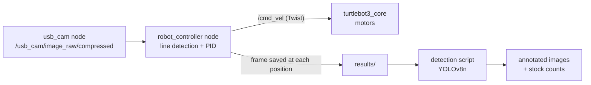

# 🤖 Autonomous Robot for Inventory Monitoring in SMEs

A low-cost autonomous mobile robot that follows a line around a workspace, stops at fixed positions, and counts stock with a custom-trained **YOLOv8n** model — no RFID, barcodes or QR codes required.

Built on a **TurtleBot3 Burger** with a USB webcam and **ROS Noetic**. Total hardware cost: **under £1,000**.

📹 **Full walkthrough & live demo:** https://www.youtube.com/watch?v=drLWpMeTv8o

> Undergraduate thesis project — BEng Robotics Engineering, Cardiff Metropolitan University, 2024.

---

## How it works



1. The robot follows a **black line** on the floor, using only the bottom quarter of the camera frame.
2. When it sees a **wide horizontal line across its path**, it treats that as a stocktake position: it stops, turns to face the shelf, saves a frame, turns back, and carries on.
3. A separate detection script watches the image folder, runs **YOLOv8n** on each new frame, and prints how many items were found at each position plus running totals.

**Approach.** This was an experimental build rather than a theory-first one. The processing steps were taken from published line-following and vision-navigation papers (Gaussian blur → HSV thresholding → morphology → contours for detection, PID for steering), then tuned and validated on the real robot.

---

## 1. Line detection

A standard OpenCV pipeline, run on every incoming frame.

| Step | Code | Why |
|------|------|-----|
| 1. Crop to bottom quarter | `frame[int(3*height/4):, :]` | Only the floor directly ahead matters. Drops ~75% of the pixels, which keeps the loop fast. |
| 2. Gaussian blur, 5×5 | `cv2.GaussianBlur(img, (5,5), 0)` | Smooths sensor noise and floor texture *before* thresholding, so grain doesn't get frozen into the mask. Small kernel keeps the line edges sharp. |
| 3. Convert to HSV | `cv2.cvtColor(..., COLOR_BGR2HSV)` | Separates colour from brightness, so one fixed threshold survives different lighting. |
| 4. Threshold for black | `cv2.inRange(hsv, (0,0,0), (180,255,100))` | Keeps any pixel with brightness below 100 at any hue → a binary mask of the line. |
| 5. Morphological closing, 5×5 | `cv2.morphologyEx(mask, MORPH_CLOSE, k)` | Fills pinholes and small gaps so the line stays one continuous shape instead of breaking up. |
| 6. Find contours | `cv2.findContours(...)` | Turns the mask into candidate shapes. |
| 7. Filter by size | keep contours where `w*h > 1600` px | Discards speckle and small dark objects on the floor. |
| 8. Take the largest contour | `cv2.boundingRect(...)` | That box is the line. |

**The steering error** is then just one number:

```python
error = (frame_width / 2) - (box_x + box_w / 2)
```

In plain terms: *how many pixels left or right of the image centre the line is sitting.* Zero means dead centre, positive means the line is off to one side, negative to the other. That single value is the only thing the controller needs.

---

## 2. Line following — PID

The error drives a PID controller (via the `simple_pid` library) which outputs an angular velocity to steer the line back to the centre of the frame:

```
u(t) = Kp·e(t) + Ki·∫e(t)dt + Kd·de(t)/dt
```

- `u` is published as `angular.z` in a ROS `Twist` message
- forward speed `linear.x` is held constant at 0.1 m/s
- the loop runs at 10 Hz

| Parameter | Value |
|-----------|-------|
| `Kp` | 0.003 |
| `Ki` | 0.0035 |
| `Kd` | 0.0006 |
| Output limits | ±0.2 rad/s |
| Forward speed | 0.1 m/s |
| Loop rate | 10 Hz |

Output is clamped to ±0.2 rad/s so a large error can't make the robot spin on the spot.

**Tuning (Ziegler–Nichols, done on the robot).**

1. Set `Ki = Kd = 0` and raised `Kp` until the robot oscillated steadily around the line. That happened at **`Kp` ≈ 0.005** — the critical gain.
2. Applied the classic Ziegler–Nichols ratios to that gain to get the three values above.
3. Confirmed the result on the robot and from logged error-vs-time plots (Matplotlib).

---

## 3. Position trigger and the stop–turn–capture sequence

A stocktake position is marked by a second line laid **across** the path. It's detected when the contour is both wide and large:

```python
if aspect_ratio > 5 and w * h > 20000:   # wide and big = a marker, not the path
```

A normally followed line never satisfies both conditions, which is what keeps false triggers out. Once triggered:

1. Stop line following
2. Turn at `+0.3 rad/s` for 4.5 s → faces the shelf
3. Hold for ~5 s, then save the frame to `results/outputposition<N>.jpg`
4. Turn at `-0.3 rad/s` for 4.5 s → back onto the path
5. Drive forward at 0.1 m/s for 1 s to clear the marker
6. Reset the trigger and resume line following

---

## 4. Inventory detection — custom YOLOv8n

A standalone Python script rather than a ROS node, which keeps the inference load off the control loop and lets it run on any machine.

- **Model:** YOLOv8n, custom trained, single class `mug` (standing in for stock)
- **Dataset:** 709 source images → **1,779 after augmentation** (1.5 px blur, ±10% brightness), split 90% train / 8% validation / 2% test
- **Training:** 100 epochs on a Tesla T4 in Google Colab
- **Runtime:** CPU inference, confidence threshold **0.85**, annotated images written to `positions/`
- **Output:** per-position item count and confidence, plus running totals of positions and items, printed to the terminal

The script polls `results/`, runs the model on each new frame, writes the annotated version, then deletes the source image so it's ready for the next position.

**Why YOLOv8n:** it's the smallest YOLOv8 variant, fast enough for CPU-only inference, and benchmarks higher than earlier nano models — the right trade-off for low-cost hardware.

---

## System architecture

| Node / script | Runs on | Subscribes | Publishes | Role |
|---------------|---------|------------|-----------|------|
| `usb_cam` | TurtleBot3 | — | `/usb_cam/image_raw/compressed` | Streams webcam frames |
| `robot_controller` | PC | `/usb_cam/image_raw/compressed` | `cmd_vel` | Line detection, PID steering, stop–turn–capture, saves position images |
| `turtlebot3_core` | TurtleBot3 | `cmd_vel` | odometry / sensor topics | Drives the Dynamixel motors |
| `object_detection.py` | Any machine | watches `results/` | writes `positions/` + terminal report | YOLOv8n stock counting |

Package: `linefollow_detectionsys`. The ROS master runs on the PC; the camera and motor nodes run on the robot.

---

## Hardware

| Part | Detail |
|------|--------|
| Platform | TurtleBot3 Burger (~£700) |
| On-board compute | Raspberry Pi 3 Model B — Ubuntu 20.04, ROS Noetic |
| Motor control | OpenCR board (STM32F7) + 2× XL430-W250 Dynamixel |
| Camera | Advent 1080p USB webcam |
| Power | 11 V LiPo |
| Off-board | Ubuntu laptop running the ROS master, control node and detection script |

---

## Repository structure

```
.
├── src/
│   ├── robot_controller.py   # line detection + PID + stop-turn-capture (ROS node)
│   └── object_detection.py   # YOLOv8n inference + reporting (standalone)
├── models/
│   └── best.pt               # trained YOLOv8n weights
├── results/                  # frames captured at each position (detector input)
├── positions/                # annotated detection output
├── launch/                   # ROS launch files
├── package.xml
└── README.md
```

---

## Getting started

```bash
# On the TurtleBot3
roslaunch turtlebot3_bringup turtlebot3_robot.launch
roslaunch usb_cam usb_cam-test.launch

# On the PC (ROS master)
roscore
rosrun linefollow_detectionsys robot_controller.py

# In a second terminal on the PC
python3 src/object_detection.py
```

Requires ROS Noetic, OpenCV, `cv_bridge`, `simple-pid`, `ultralytics` and `numpy`.

---

## Results

Every test below was run for 10 iterations.

**Line detection** — 3 backgrounds (white, dark grey textured, grey with spots) × 3 lighting conditions (standard, directly under a light, away from the light):

| Test | Result |
|------|--------|
| Line detected at standstill | 10/10 in all 9 combinations |
| Line held while following | 10/10 in all 9 combinations |
| False positive from a small black object in frame | 0/10 in all 9 combinations |

**Line following (PID):**

| Metric | Result |
|--------|--------|
| Steady-state error, starting centred | ≈ ±15 px |
| Overshoot from a 182 px starting error | 72 px (39%) |
| Settling time from a 182 px starting error | ≈ 2.3 s |

An error that large only occurs on very tight curves. From a near-centred start the robot tracks the line smoothly, with minor oscillation only after tight bends.

**Object detection (validation set):**

| Metric | Score |
|--------|-------|
| mAP@50 | 0.982 |
| Precision | 0.92 |
| Recall | 0.94 |
| "Extreme" (blurred / distorted) test images | 10/10 detected, all > 0.8 confidence |

**Position trigger:** correctly fired on every wide across-path marker and never fired on small or low-aspect-ratio lines.

**Integration:** 10 full runs of a 4-position course — an image was captured, analysed and reported at every position, 4/4 every run.

---

## Known limitations and next steps

- **Turns are open loop.** The 90° turns are timed (4.5 s at 0.3 rad/s) rather than closed on odometry, so battery voltage and floor friction change the actual angle. Closing the loop on `/odom` would make it repeatable.
- **Tight curves are the weak point.** Overshoot grows with error, so fast tight bends are where accuracy drops. Gain scheduling, or reducing `linear.x` when `|error|` is large, would help.
- **Detection handoff uses the filesystem** (`results/` → `positions/`) rather than a ROS topic. Simple and it works, but publishing to an `/inventory` topic would remove the polling delay and make the system properly modular.
- **Error is read from the wrong contour.** `x` and `w` are taken from the last contour that passed the size filter rather than from `largest_contour`. Identical whenever only one contour survives, but it should read from the largest box.
- **`self.stop` is called without `()`** in a couple of places, so the explicit stop never actually executes. Harmless in practice because the next velocity command overwrites it, but worth fixing.
- **Single class.** `mug` is a stand-in for stock. More classes, plus an expected count per shelf, would turn this from item counting into a real inventory check.

---

Built with TurtleBot3, ROS Noetic, OpenCV, simple-pid, Ultralytics YOLOv8 and Matplotlib.

